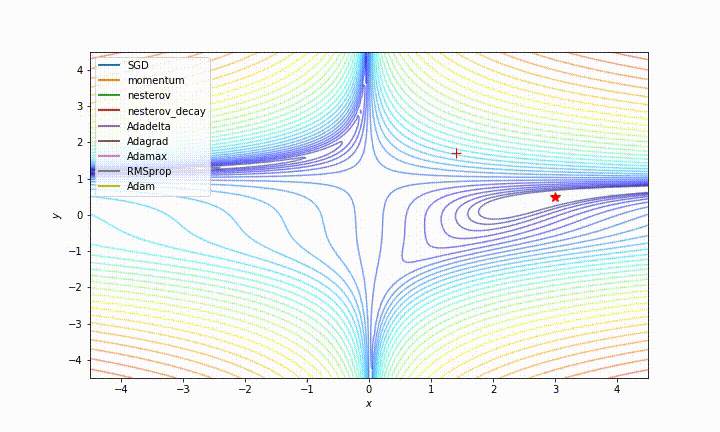

This project generates animations of pytorch optimizers solving toy problems. Examples Below.

[Some nice animations](http://www.denizyuret.com/2015/03/alec-radfords-animations-for.html) were posted a few years ago by Alex Radford but didn't include Adam or landscapes with noise.  [Louis Tiao](http://louistiao.me/notes/visualizing-and-animating-optimization-algorithms-with-matplotlib/) blogged about how to make the visulisations. The [pytorch unit tests](https://github.com/pytorch/pytorch/blob/master/test/test_optim.py) show how to run the optimizers on a test function. I pulled these together and shared the result at https://github.com/wassname/visualizing_torch_optim. Please make some better animations than I did and share them.

# Examples

# Usage:

- `git clone https://github.com/wassname/visualizing_torch_optim`
- `jupyter notebook`
- open main.ipynb
- install any missing dependencies with pip
