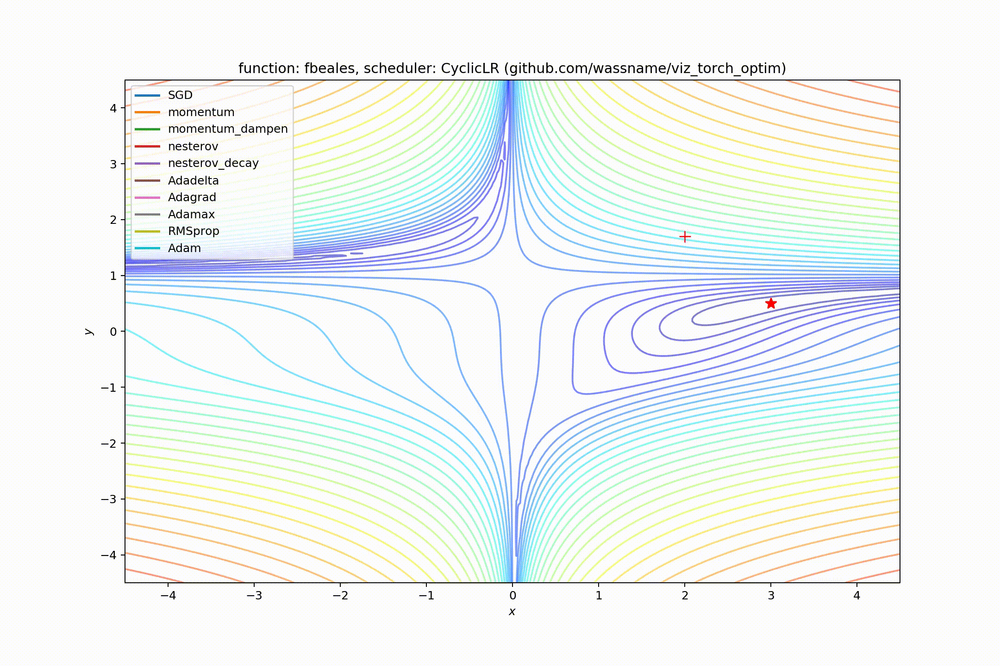
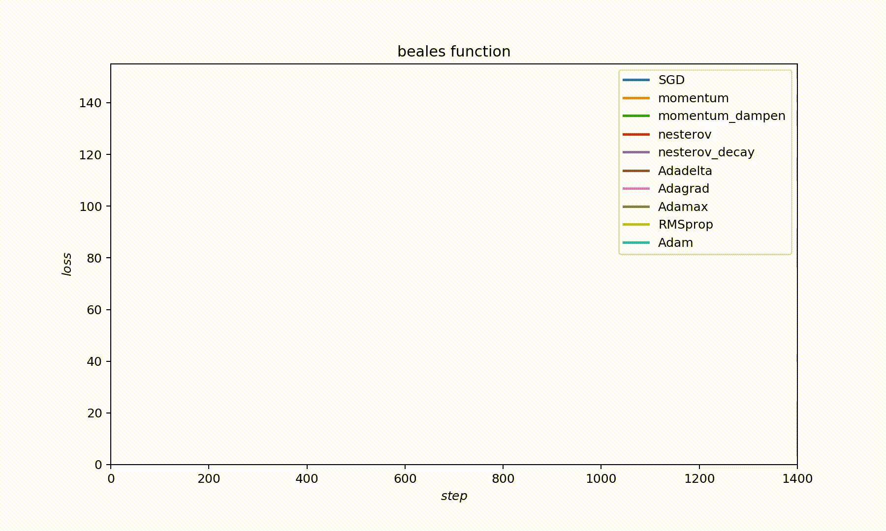
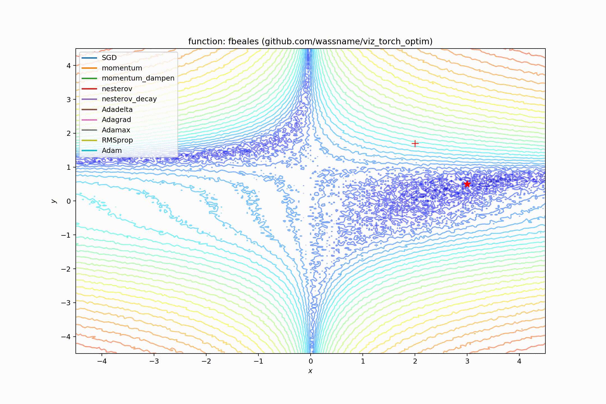
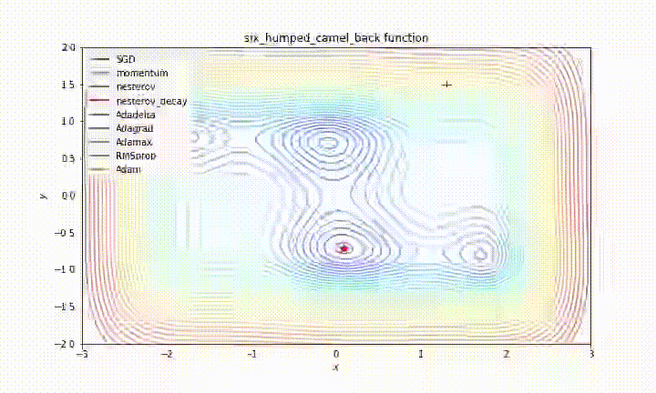
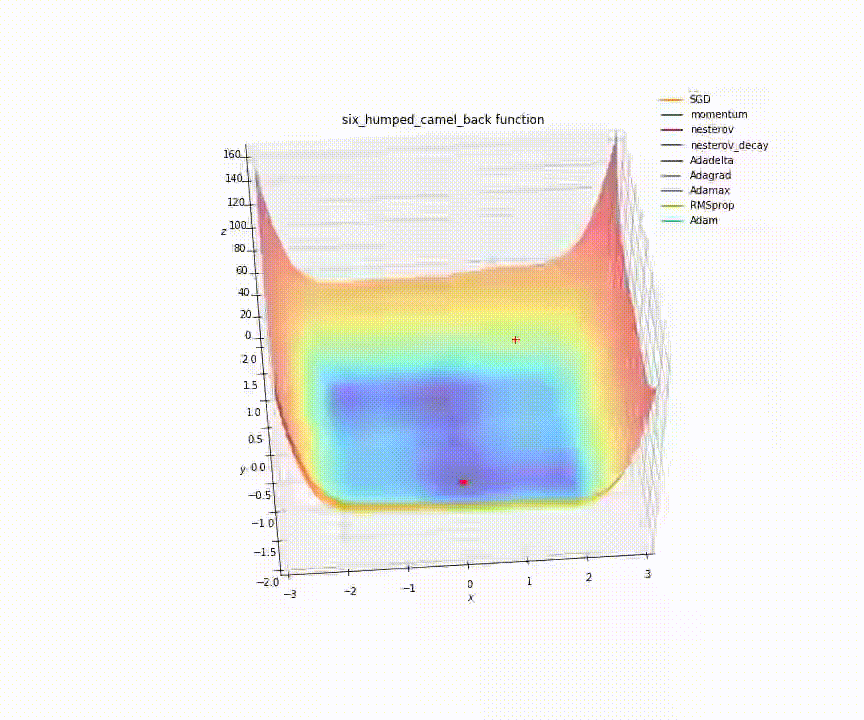
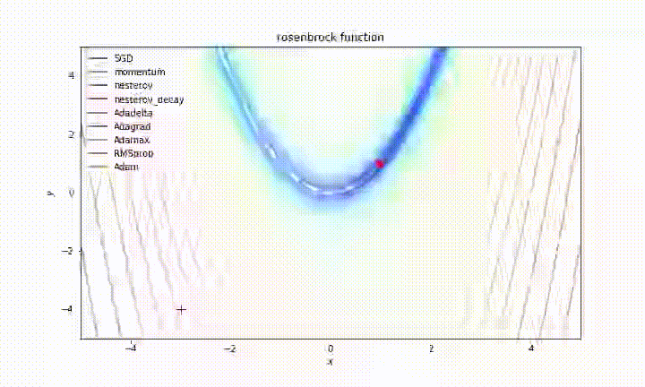

This project generates animations of pytorch optimizers solving toy problems. Examples Below.

[Some nice animations](http://www.denizyuret.com/2015/03/alec-radfords-animations-for.html) were posted a few years ago by Alex Radford but didn't include the Adam optimizer or landscapes with noise.  [Louis Tiao](http://louistiao.me/notes/visualizing-and-animating-optimization-algorithms-with-matplotlib/) blogged about how to make the visualizations. The [pytorch unit tests](https://github.com/pytorch/pytorch/blob/master/test/test_optim.py) show how to run the optimizers on test functions. I pulled these together and shared the result at https://github.com/wassname/viz_torch_optim.

# Examples

Please note that each optimizer has a differen't learning rate, so they are not directly comparable. This is because simpler optimizers perform better on low dimensional problems. So, with a constant learning rate, the simpler SGD optimizer races to the finish while Adam crawls along. In this case we SGD is to fast to see and Adam is too bording to watch. So I used differen't learning rates for each optimizer so I could show them on the same video.

## With cyclic annealing:

### Beales function with noise (cyclic annealing)

<!--  -->

### Beales function with noise (cyclic annealing)

## Constant learning rate

### Beales function

## Beales function with noise

### Six humped camel function

### Rosenbrock function

# Usage:

- `git clone https://github.com/wassname/viz_torch_optim`
- `jupyter notebook`
- open main.ipynb
- install any missing dependencies with pip
